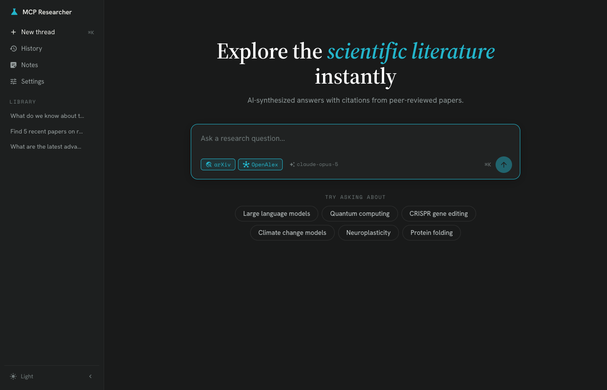
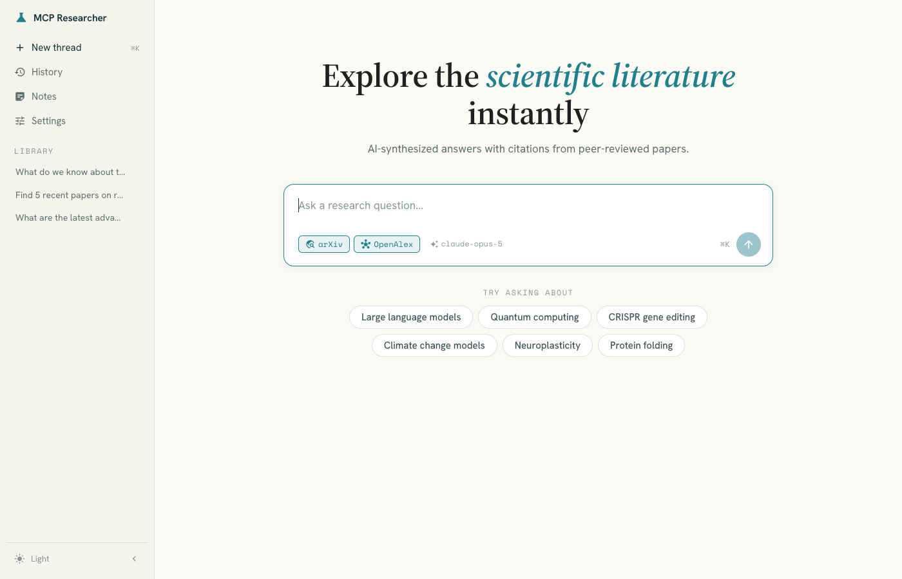
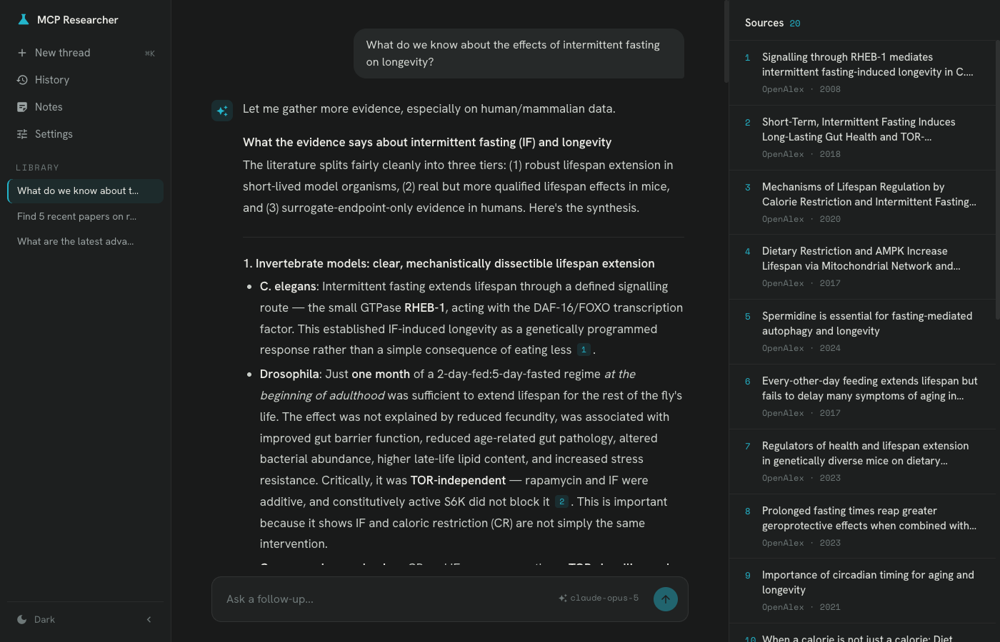
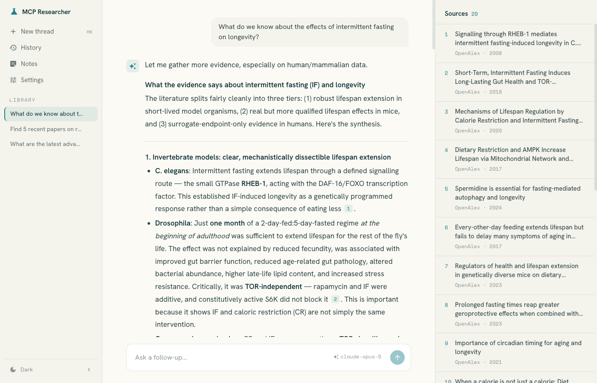
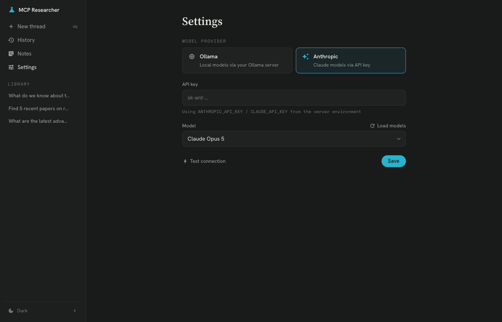
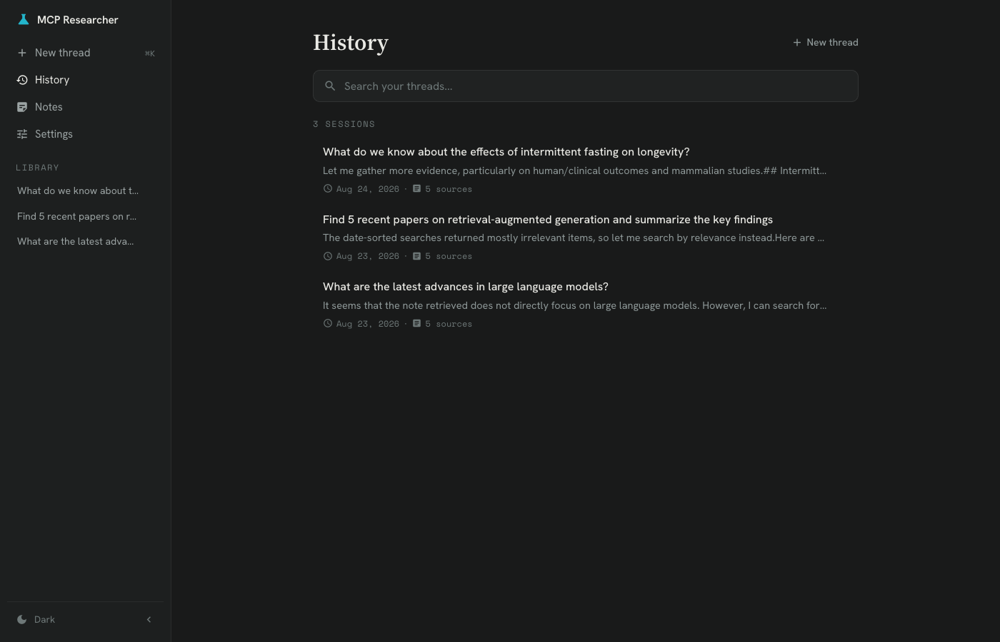
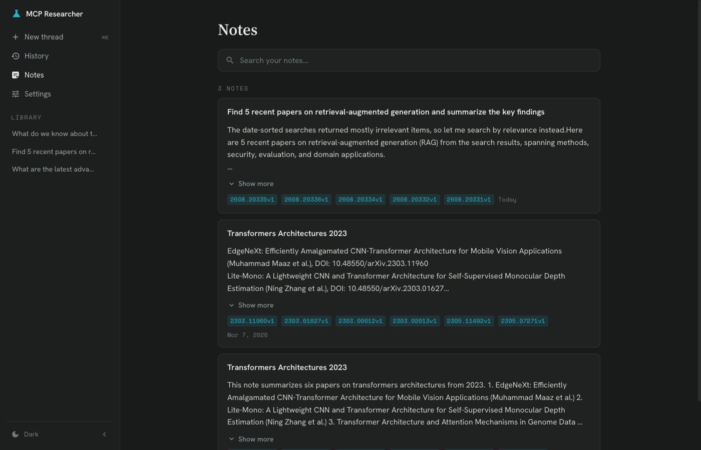

# MCP Academic Researcher

A full-stack AI-powered research assistant that searches, synthesizes, and manages academic papers using the Model Context Protocol (MCP). Inference runs through a pluggable provider adapter -- a local model via Ollama, or Claude via the Anthropic API -- selected at runtime from the in-app Settings page. Built with Angular, NestJS, and Python (FastAPI + MCP SDK).

---

## Table of Contents

- [Screenshots](#screenshots)
- [Architecture Overview](#architecture-overview)
- [Request Workflow](#request-workflow)
- [Tech Stack](#tech-stack)
- [Project Structure](#project-structure)
- [Port Assignments](#port-assignments)
- [Prerequisites](#prerequisites)
- [Quick Start](#quick-start)
- [LLM Providers & Settings](#llm-providers--settings)
- [Testing](#testing)
- [Docker Compose](#docker-compose)
- [Environment Variables](#environment-variables)
- [API Overview](#api-overview)
- [License](#license)

---

## Screenshots

A quiet research console: a 240px navigation rail, a boxed composer with source-scope toggles, and a numbered sources rail beside every answer. Dark is the default; a light "Paper" theme ships alongside it.

| | |
|---|---|
| <br>**Home** -- hero, boxed composer, source toggles and the active-model chip | <br>**Home, light** -- the "Paper" theme |
| <br>**Research** -- streamed answer with `[n]` citation chips and the numbered sources rail | <br>**Research, light** -- a source row expanded to its abstract and actions |
| <br>**Settings** -- pick Ollama or Anthropic, choose a model, test the connection | <br>**History** -- every past thread at a glance |
| <br>**Notes** -- saved notes with semantic search | |

---

## Architecture Overview

The system follows a four-layer architecture: an Angular frontend communicates with a NestJS API gateway, which proxies requests to a Python orchestrator. The orchestrator manages MCP server subprocesses (Papers, Notes, Citations) over stdio and drives the selected LLM through a provider adapter (`orchestrator/llm.py`) -- a local model on Ollama, or Claude over the Anthropic API. The provider, model and credentials travel with every `/chat` call, so the choice is made at runtime from Settings rather than baked into the deployment.

```
                            High-Level Flow

  ┌─────────────────┐     ┌─────────────────┐     ┌─────────────────┐
  │   Angular UI    │────>│  NestJS Gateway  │────>│ Python          │
  │   (port 4200)   │     │  (port 3000)     │     │ Orchestrator    │
  └─────────────────┘     └─────────────────┘     │ (port 8000)     │
                                                   └────────┬────────┘
                                                            │
                          ┌─────────────────────────────────┼──────────────────────────────┐
                          │                                 │                              │
                          v                                 v                              v
                 ┌────────────────┐               ┌────────────────┐             ┌────────────────┐
                 │  Papers MCP    │               │  Notes MCP     │             │ Citations MCP  │
                 │  Server        │               │  Server        │             │ Server         │
                 └────────────────┘               └────────────────┘             └────────────────┘
                                                            │
                                                            v
                                                   ┌──────────────────────┐
                                                   │  LLM Provider        │
                                                   │  Ollama :11434  or   │
                                                   │  Anthropic Claude API│
                                                   └──────────────────────┘
```

<details>
<summary><strong>Full System Architecture Diagram</strong></summary>

```
┌─────────────────────────────────────────────────────────────────────────────────────────┐
│                                    USER LAYER                                            │
│                                                                                         │
│    ┌─────────────────────────────────────────────────────────────────────────────┐     │
│    │                         Angular Frontend                                     │     │
│    │                                                                             │     │
│    │  Technologies:                                                              │     │
│    │  - Angular 17+ (standalone components)                                      │     │
│    │  - Angular Material or PrimeNG (UI components)                              │     │
│    │  - RxJS (reactive state management)                                         │     │
│    │  - Server-Sent Events (SSE) for streaming responses                         │     │
│    │                                                                             │     │
│    │  Responsibilities:                                                          │     │
│    │  - Chat interface for user queries                                          │     │
│    │  - Display search results and paper metadata                                │     │
│    │  - Citation management UI                                                   │     │
│    │  - Notes editor                                                             │     │
│    │  - Research project organization                                            │     │
│    │                                                                             │     │
│    │  Port: 4200 (development)                                                   │     │
│    └──────────────────────────────────┬──────────────────────────────────────────┘     │
│                                       │                                                 │
└───────────────────────────────────────┼─────────────────────────────────────────────────┘
                                        │
                                        │ HTTP/REST + SSE
                                        │ (JSON payloads)
                                        │
┌───────────────────────────────────────┼─────────────────────────────────────────────────┐
│                                API GATEWAY LAYER                                         │
│                                       │                                                 │
│    ┌──────────────────────────────────▼──────────────────────────────────────────┐     │
│    │                         NestJS API Server                                    │     │
│    │                                                                             │     │
│    │  Technologies:                                                              │     │
│    │  - NestJS 10+ (Node.js framework)                                           │     │
│    │  - TypeScript                                                               │     │
│    │  - Passport.js (authentication, optional)                                   │     │
│    │  - TypeORM or Prisma (database ORM)                                         │     │
│    │  - class-validator (request validation)                                     │     │
│    │                                                                             │     │
│    │  Responsibilities:                                                          │     │
│    │  - REST API endpoints for frontend                                          │     │
│    │  - WebSocket/SSE for streaming LLM responses                                │     │
│    │  - Request validation and sanitization                                      │     │
│    │  - Session/conversation management                                          │     │
│    │  - User authentication (if needed)                                          │     │
│    │  - Forwards requests to Python Orchestrator                                 │     │
│    │                                                                             │     │
│    │  Port: 3000                                                                 │     │
│    └──────────────────────────────────┬──────────────────────────────────────────┘     │
│                                       │                                                 │
└───────────────────────────────────────┼─────────────────────────────────────────────────┘
                                        │
                                        │ HTTP/REST or gRPC
                                        │ (Internal communication)
                                        │
┌───────────────────────────────────────┼─────────────────────────────────────────────────┐
│                              MCP HOST LAYER (Python)                                     │
│                                       │                                                 │
│    ┌──────────────────────────────────▼──────────────────────────────────────────┐     │
│    │                      Python Orchestrator Service                             │     │
│    │                                                                             │     │
│    │  Technologies:                                                              │     │
│    │  - Python 3.11+                                                             │     │
│    │  - FastAPI (HTTP server for NestJS communication)                           │     │
│    │  - MCP Python SDK (mcp package)                                             │     │
│    │  - ollama-python (Ollama client library)                                    │     │
│    │  - asyncio (async coordination)                                             │     │
│    │  - Pydantic (data validation)                                               │     │
│    │                                                                             │     │
│    │  Responsibilities:                                                          │     │
│    │  - Context window assembly and tool execution loop (agentic loop)          │     │
│    │  - Stateless per-request: full history supplied by NestJS on each call     │     │
│    │  - Context window management                                                │     │
│    │  - MCP client connections to all servers                                    │     │
│    │  - Communication with Ollama                                                │     │
│    │  - Response streaming back to NestJS                                        │     │
│    │                                                                             │     │
│    │  Port: 8000                                                                 │     │
│    │                                                                             │     │
│    │  ┌─────────────────────────────────────────────────────────────────────┐   │     │
│    │  │                    MCP Client Manager                                │   │     │
│    │  │                                                                     │   │     │
│    │  │  - Maintains persistent connections to MCP servers                  │   │     │
│    │  │  - Routes tool calls to appropriate servers                         │   │     │
│    │  │  - Aggregates tool definitions from all servers                     │   │     │
│    │  │  - Handles server lifecycle (start/stop/restart)                    │   │     │
│    │  └─────────────────────────────────────────────────────────────────────┘   │     │
│    └──────────────────────────────────┬──────────────────────────────────────────┘     │
│                                       │                                                 │
│          ┌────────────────┬────────────────┐                                          │
│          │                │                │                                          │
│          v                v                v                                          │
│    ┌─────────────┐ ┌─────────────┐ ┌─────────────┐                                    │
│    │ MCP Client  │ │ MCP Client  │ │ MCP Client  │                                    │
│    │  (Papers)   │ │  (Notes)    │ │ (Citations) │                                    │
│    └──────┬──────┘ └──────┬──────┘ └──────┬──────┘                                    │
│              │                     │                     │                             │
└──────────────┼─────────────────────┼─────────────────────┼─────────────────────────────┘
               │                     │                     │
               │ stdio (JSON-RPC)    │ stdio (JSON-RPC)    │ stdio (JSON-RPC)
               │                     │                     │
┌──────────────┼─────────────────────┼─────────────────────┼─────────────────────────────┐
│              │        MCP SERVERS LAYER (Python)         │                             │
│              │                     │                     │                             │
│    ┌─────────▼─────────┐ ┌─────────▼─────────┐ ┌─────────▼─────────┐                   │
│    │   Papers Server   │ │   Notes Server    │ │  Citations Server │                   │
│    │                   │ │                   │ │                   │                   │
│    │ Technologies:     │ │ Technologies:     │ │ Technologies:     │                   │
│    │ - Python 3.11+    │ │ - Python 3.11+    │ │ - Python 3.11+    │                   │
│    │ - MCP SDK         │ │ - MCP SDK         │ │ - MCP SDK         │                   │
│    │ - httpx (async    │ │ - SQLAlchemy      │ │ - bibtexparser    │                   │
│    │   HTTP client)    │ │ - sqlite-vec      │ │ - citeproc-py     │                   │
│    │ - xmltodict       │ │   (vector search) │ │ - habanero        │                   │
│    │                   │ │ - httpx (calls    │ │   (CrossRef API)  │                   │
│    │ Responsibilities: │ │   Ollama embed    │ │                   │                   │
│    │ - Search arXiv    │ │   endpoint)       │ │ Responsibilities: │                   │
│    │ - Search Semantic │ │                   │ │ - Manage BibTeX   │                   │
│    │   Scholar         │ │ Responsibilities: │ │ - Format citations│                   │
│    │ - Parse metadata  │ │ - CRUD notes      │ │ - Resolve DOIs    │                   │
│    │ - Parse metadata  │ │ - Semantic search │ │ - Export biblio   │                   │
│    │                   │ │ - Tag management  │ │                   │                   │
│    │ Tools exposed:    │ │ - Link notes      │ │ Tools exposed:    │                   │
│    │ - search_arxiv    │ │                   │ │ - add_citation    │                   │
│    │ - search_semantic │ │ Tools exposed:    │ │ - format_citation │                   │
│    │ - get_paper       │ │ - create_note     │ │ - export_bibtex   │                   │
│    │                   │ │ - search_notes    │ │ - resolve_doi     │                   │
│    │                   │ │ - update_note     │ │                   │                   │
│    └─────────┬─────────┘ └─────────┬─────────┘ └─────────┬─────────┘                   │
│              │                     │                     │                             │
└──────────────┼─────────────────────┼─────────────────────┼─────────────────────────────┘
               │                     │                     │
               │                     │                     │
┌──────────────┼─────────────────────┼─────────────────────┼─────────────────────────────┐
│              │           EXTERNAL SERVICES               │                             │
│              │                     │                     │                             │
│    ┌─────────▼─────────┐           │                     │                             │
│    │   arXiv API       │           │                     │                             │
│    │   (Cornell)       │           │                     │                             │
│    │                   │           │                     │                             │
│    │ - Free, no auth   │           │                     │                             │
│    │ - XML responses   │           │                     │                             │
│    │ - Rate: 1/3sec    │           │                     │                             │
│    └───────────────────┘           │                     │                             │
│                                    │                     │                             │
│    ┌───────────────────┐           │                     │                             │
│    │ Semantic Scholar  │           │                     │                             │
│    │      API          │           │                     │                             │
│    │                   │           │                     │                             │
│    │ - Free tier avail │           │                     │                             │
│    │ - JSON responses  │           │                     │                             │
│    │ - Rate: 100/5min  │           │                     │                             │
│    └───────────────────┘           │                     │                             │
│                                    │                     │                             │
│    ┌───────────────────┐           │                     │                             │
│    │   CrossRef API    │<──────────┼─────────────────────┘                             │
│    │                   │           │                                                   │
│    │ - DOI resolution  │           │                                                   │
│    │ - Free            │           │                                                   │
│    └───────────────────┘           │                                                   │
│                                    │                                                   │
└────────────────────────────────────┼───────────────────────────────────────────────────┘
                                     │
┌────────────────────────────────────┼───────────────────────────────────────────────────┐
│                          DATA STORAGE LAYER              │                             │
│                                    │                     │                             │
│    ┌───────────────────────────────▼─────────────────────────────────────────────┐    │
│    │                         SQLite Database                                      │    │
│    │                                                                             │    │
│    │  Technologies:                                                              │    │
│    │  - SQLite 3.x (file-based database)                                         │    │
│    │  - sqlite-vec extension (vector similarity search)                          │    │
│    │                                                                             │    │
│    │  Tables:                                                                    │    │
│    │  - conversations (chat history)                                             │    │
│    │  - notes (research notes with embeddings)                                   │    │
│    │  - citations (bibliographic entries)                                        │    │
│    │  - papers_cache (cached paper metadata)                                     │    │
│    │                                                                             │    │
│    │  Location: ./data/research.db                                               │    │
│    └─────────────────────────────────────────────────────────────────────────────┘    │
│                                                                                       │
│    ┌─────────────────────────────────────────────────────────────────────────────┐    │
│    │                         File Storage                                         │    │
│    │                                                                             │    │
│    │  Structure:                                                                 │    │
│    │  ./data/                                                                    │    │
│    │    ├── exports/        (exported bibliographies)                            │    │
│    │    └── attachments/    (note attachments)                                   │    │
│    └─────────────────────────────────────────────────────────────────────────────┘    │
│                                                                                       │
└───────────────────────────────────────────────────────────────────────────────────────┘

┌───────────────────────────────────────────────────────────────────────────────────────┐
│                              LLM INFERENCE LAYER                                       │
│                                                                                       │
│    ┌─────────────────────────────────────────────────────────────────────────────┐    │
│    │                    LLM Providers (chosen in Settings)                       │    │
│    │                                                                             │    │
│    │  Adapter: orchestrator/llm.py -- one LLMClient interface                    │    │
│    │                                                                             │    │
│    │  Ollama (local, default)                                                    │    │
│    │  - Runtime: Ollama; default model qwen2.5:7b                                │    │
│    │  - Alternatives: Llama, Mistral, DeepSeek, any pulled model                 │    │
│    │  - API endpoint: http://localhost:11434                                     │    │
│    │  - Hardware: 7-8B model 8GB+ RAM, 6GB+ VRAM (GPU optional)                  │    │
│    │              70B model 64GB+ RAM or 48GB+ VRAM                              │    │
│    │                                                                             │    │
│    │  Anthropic Claude (hosted, optional)                                        │    │
│    │  - SDK: anthropic (Python, >=1.0) -- streaming + tool use                   │    │
│    │  - Default model: claude-opus-5                                             │    │
│    │  - API key from Settings, else ANTHROPIC_API_KEY/CLAUDE_API_KEY             │    │
│    │                                                                             │    │
│    │  Responsibilities (either provider):                                        │    │
│    │  - Classify search intent, run the agentic tool loop                        │    │
│    │  - Process tool-calling requests                                            │    │
│    │  - Generate natural language responses                                      │    │
│    └─────────────────────────────────────────────────────────────────────────────┘    │
│                                                                                       │
│    ┌─────────────────────────────────────────────────────────────────────────────┐    │
│    │                    Embedding Model (via Ollama)                              │    │
│    │                                                                             │    │
│    │  Model: nomic-embed-text (or mxbai-embed-large)                             │    │
│    │  API: POST http://localhost:11434/api/embeddings                            │    │
│    │                                                                             │    │
│    │  Used by (via HTTP -- embeddings run in Ollama, not in-process):            │    │
│    │  - Notes Server (semantic search over saved notes)                          │    │
│    │  - Papers Server (optional: finding similar papers)                         │    │
│    │                                                                             │    │
│    │  Anthropic has no embeddings API, so Ollama must be running                 │    │
│    │  for notes even when chat is answered by Claude.                            │    │
│    └─────────────────────────────────────────────────────────────────────────────┘    │
│                                                                                       │
└───────────────────────────────────────────────────────────────────────────────────────┘
```

</details>

---

## Request Workflow

The following diagrams describe the complete lifecycle of a user query, from submission to displayed results.

The walkthrough names Ollama at each inference step because it is the default provider; with Anthropic selected the same steps run against the Claude API through the same adapter. The gateway also attaches the saved `llm` provider block and the composer's active `sources` filter to every request it forwards.

<details>
<summary><strong>Full Request Workflow (Steps 1-12)</strong></summary>

```
┌─────────────────────────────────────────────────────────────────────────────────┐
│ STEP 1: User submits query                                                       │
│                                                                                 │
│ User types: "Find papers about attention mechanisms in transformers from 2023"  │
│                                                                                 │
│ Angular Frontend:                                                               │
│ 1. Captures input from chat text field                                          │
│ 2. Creates request payload:                                                     │
│    {                                                                            │
│      "conversationId": "conv_abc123",                                           │
│      "message": "Find papers about attention mechanisms in transformers..."     │
│    }                                                                            │
│ 3. Sends a single streaming POST to NestJS: POST /api/chat/stream               │
│    The response body is a chunked HTTP stream (SSE lines); no separate GET      │
│    channel is opened. This avoids the race condition where tokens could arrive  │
│    before a separately-opened SSE connection was ready.                         │
│                                                                                 │
│    SAFE PATTERN (implemented):                                                  │
│      POST /api/chat/stream  ──> streaming response on the same connection       │
│                                                                                 │
│    UNSAFE PATTERN (avoided):                                                    │
│      POST /api/chat/message  then  GET /api/chat/stream/{id}                   │
│      (tokens may arrive before the SSE channel is established -- race cond.)   │
└─────────────────────────────────────────────────────────────────────────────────┘
                                        │
                                        v
┌─────────────────────────────────────────────────────────────────────────────────┐
│ STEP 2: NestJS processes and forwards                                            │
│                                                                                 │
│ NestJS API Server:                                                              │
│ 1. Receives streaming POST request                                              │
│ 2. Validates request body (class-validator)                                     │
│ 3. Retrieves/creates conversation from SQLite (NestJS is sole owner of state)  │
│ 4. Forwards to Python Orchestrator -- passes FULL history so Orchestrator is   │
│    stateless and reconstructs context entirely from what NestJS provides:       │
│    POST http://localhost:8000/chat                                              │
│    {                                                                            │
│      "conversation_id": "conv_abc123",                                          │
│      "message": "Find papers about attention mechanisms...",                    │
│      "history": [...all previous messages from SQLite...]                       │
│    }                                                                            │
│ 5. Streams Orchestrator response chunks back to Angular on the same connection  │
│ 6. Persists completed assistant turn to SQLite once streaming ends              │
└─────────────────────────────────────────────────────────────────────────────────┘

┌─────────────────────────────────────────────────────────────────────────────────┐
│ STEP 3: Orchestrator receives request                                            │
│                                                                                 │
│ Python Orchestrator (FastAPI):                                                  │
│ 1. Receives chat request                                                        │
│ 2. Loads conversation history                                                   │
│ 3. Prepares messages array for Ollama:                                          │
│    [                                                                            │
│      {"role": "system", "content": "You are a research assistant..."},          │
│      {"role": "user", "content": "Find papers about attention mechanisms..."}   │
│    ]                                                                            │
│ 4. Collects tool definitions from all connected MCP servers                     │
│ 5. Sends to Ollama with tools                                                   │
└─────────────────────────────────────────────────────────────────────────────────┘
                                        │
                                        v
┌─────────────────────────────────────────────────────────────────────────────────┐
│ STEP 4: Ollama decides to use tools                                              │
│                                                                                 │
│ Ollama (Llama 3.1):                                                             │
│ 1. Analyzes user query                                                          │
│ 2. Reviews available tools:                                                     │
│    - search_arxiv: Search arXiv for papers                                      │
│    - search_semantic_scholar: Search Semantic Scholar                           │
│    - create_note: Create a research note                                        │
│    - ... etc                                                                    │
│ 3. Decides: "I should search for papers. Let me use search_arxiv"               │
│ 4. Generates tool call:                                                         │
│    {                                                                            │
│      "tool_calls": [{                                                           │
│        "function": {                                                            │
│          "name": "search_arxiv",                                                │
│          "arguments": {                                                         │
│            "query": "attention mechanisms transformers",                        │
│            "max_results": 10,                                                   │
│            "sort_by": "submittedDate",                                          │
│            "categories": ["cs.LG", "cs.CL"]                                     │
│          }                                                                      │
│        }                                                                        │
│      }]                                                                         │
│    }                                                                            │
└─────────────────────────────────────────────────────────────────────────────────┘

┌─────────────────────────────────────────────────────────────────────────────────┐
│ STEP 5: Orchestrator routes tool call to MCP Server                              │
│                                                                                 │
│ Python Orchestrator:                                                            │
│ 1. Receives tool call from Ollama                                               │
│ 2. Looks up which MCP server handles "search_arxiv" -> Papers Server            │
│ 3. Sends MCP request via stdio:                                                 │
│    {                                                                            │
│      "jsonrpc": "2.0",                                                          │
│      "id": 1,                                                                   │
│      "method": "tools/call",                                                    │
│      "params": {                                                                │
│        "name": "search_arxiv",                                                  │
│        "arguments": {                                                           │
│          "query": "attention mechanisms transformers",                          │
│          "max_results": 10,                                                     │
│          "sort_by": "submittedDate",                                            │
│          "categories": ["cs.LG", "cs.CL"]                                       │
│        }                                                                        │
│      }                                                                          │
│    }                                                                            │
└─────────────────────────────────────────────────────────────────────────────────┘
                                        │
                                        v
┌─────────────────────────────────────────────────────────────────────────────────┐
│ STEP 6: Papers MCP Server executes tool                                          │
│                                                                                 │
│ Papers MCP Server:                                                              │
│ 1. Receives tool call via stdin                                                 │
│ 2. Parses arguments                                                             │
│ 3. Constructs arXiv API query:                                                  │
│    URL: http://export.arxiv.org/api/query?                                      │
│         search_query=all:attention+mechanisms+transformers                       │
│         &sortBy=submittedDate                                                   │
│         &sortOrder=descending                                                   │
│         &max_results=10                                                         │
│ 4. Sends HTTP GET request to arXiv API                                          │
│ 5. Waits for response (respecting rate limit: 3 sec between requests)           │
└─────────────────────────────────────────────────────────────────────────────────┘
                                        │
                                        v
┌─────────────────────────────────────────────────────────────────────────────────┐
│ STEP 7: External API responds                                                    │
│                                                                                 │
│ arXiv API:                                                                      │
│ 1. Searches its database                                                        │
│ 2. Returns Atom XML feed with results:                                          │
│    - 10 papers matching query                                                   │
│    - Each with: arxiv_id, title, authors, abstract, categories, dates, pdf_url  │
└─────────────────────────────────────────────────────────────────────────────────┘
                                        │
                                        v
┌─────────────────────────────────────────────────────────────────────────────────┐
│ STEP 8: Papers Server processes and returns results                              │
│                                                                                 │
│ Papers MCP Server:                                                              │
│ 1. Parses XML response                                                          │
│ 2. Converts to structured format                                                │
│ 3. Returns MCP response via stdout:                                             │
│    {                                                                            │
│      "jsonrpc": "2.0",                                                          │
│      "id": 1,                                                                   │
│      "result": {                                                                │
│        "content": [{                                                            │
│          "type": "text",                                                        │
│          "text": "[{\"arxiv_id\": \"2312.00001\", \"title\": \"...\", ...}]"    │
│        }]                                                                       │
│      }                                                                          │
│    }                                                                            │
└─────────────────────────────────────────────────────────────────────────────────┘

┌─────────────────────────────────────────────────────────────────────────────────┐
│ STEP 9: Orchestrator agentic loop -- runs until Ollama signals "stop"            │
│                                                                                 │
│ This is the governing control structure of the entire system. Steps 4-9 do not │
│ execute once; they form a loop that repeats until the model produces a final    │
│ response. A developer implementing this must write an explicit loop, not a      │
│ single-pass handler.                                                            │
│                                                                                 │
│ AGENTIC LOOP (max 10 iterations to prevent runaway):                            │
│                                                                                 │
│  ┌──────────────────────────────────────────────────────────────┐               │
│  │  Build prompt: [system prompt + full history + tool schemas] │               │
│  │                         │                                    │               │
│  │                         v                                    │               │
│  │               Call Ollama /api/chat                          │               │
│  │                         │                                    │               │
│  │            ┌────────────┴────────────┐                       │               │
│  │    finish_reason                finish_reason                │               │
│  │    == "tool_calls"              == "stop"                    │               │
│  │            │                        │                        │               │
│  │            v                        v                        │               │
│  │  Execute tool(s) via MCP     Return final answer             │               │
│  │  Append tool result          to NestJS (EXIT LOOP)           │               │
│  │  to in-memory history                                        │               │
│  │            │                                                 │               │
│  │            └──────────────── loop back to top ──────────────┘               │
│  └──────────────────────────────────────────────────────────────┘               │
│                                                                                 │
│ After each loop iteration:                                                      │
│ - Append assistant message (with tool_calls) to in-memory history               │
│ - Append tool result message to in-memory history                               │
│ - Increment iteration counter; abort with error if counter > MAX_ITERATIONS    │
│                                                                                 │
│ NestJS persists the completed assistant turn to SQLite after the loop exits.    │
└─────────────────────────────────────────────────────────────────────────────────┘
                                        │
                                        v
┌─────────────────────────────────────────────────────────────────────────────────┐
│ STEP 10: LLM generates final response                                            │
│                                                                                 │
│ Ollama (Llama 3.1):                                                             │
│ 1. Analyzes search results                                                      │
│ 2. Synthesizes natural language response:                                       │
│    "I found 10 recent papers on attention mechanisms in transformers.           │
│     Here are the most relevant ones:                                            │
│                                                                                 │
│     1. **Efficient Attention Mechanisms for Long Sequences** (Dec 2023)         │
│        Authors: Smith et al.                                                    │
│        This paper proposes a new linear attention mechanism that...             │
│                                                                                 │
│     2. **Multi-Head Attention Revisited** (Nov 2023)                            │
│        Authors: Johnson et al.                                                  │
│        The authors analyze the theoretical foundations of...                    │
│        ..."                                                                     │
│ 3. Streams response tokens                                                      │
└─────────────────────────────────────────────────────────────────────────────────┘

┌─────────────────────────────────────────────────────────────────────────────────┐
│ STEP 11: Response streams back to user                                           │
│                                                                                 │
│ Python Orchestrator -> NestJS:                                                  │
│ 1. Streams response chunks via HTTP streaming response                          │
│                                                                                 │
│ NestJS -> Angular:                                                              │
│ 2. Forwards chunks via Server-Sent Events (SSE)                                 │
│    event: message                                                               │
│    data: {"token": "I found", "done": false}                                    │
│                                                                                 │
│    event: message                                                               │
│    data: {"token": " 10 recent", "done": false}                                 │
│    ...                                                                          │
│                                                                                 │
│ Angular Frontend:                                                               │
│ 3. Receives SSE events                                                          │
│ 4. Updates chat UI in real-time as tokens arrive                                │
│ 5. Renders markdown formatting                                                  │
│ 6. Displays paper cards with metadata                                           │
│ 7. Shows "Copy citation" and "Save to library" buttons                          │
└─────────────────────────────────────────────────────────────────────────────────┘
                                        │
                                        v
┌─────────────────────────────────────────────────────────────────────────────────┐
│ STEP 12: User sees final response                                                │
│                                                                                 │
│ ┌─────────────────────────────────────────────────────────────────────────────┐ │
│ │  You: Find papers about attention mechanisms in transformers from 2023      │ │
│ │                                                                             │ │
│ │  Assistant: I found 10 recent papers on attention mechanisms in             │ │
│ │  transformers. Here are the most relevant ones:                             │ │
│ │                                                                             │ │
│ │  ┌─────────────────────────────────────────────────────────────────┐       │ │
│ │  │  Efficient Attention Mechanisms for Long Sequences               │       │ │
│ │  │    Smith, J., Lee, K., Wang, M.  *  December 2023               │       │ │
│ │  │    arXiv:2312.00001  *  cs.LG, cs.CL                            │       │ │
│ │  │                                                                 │       │ │
│ │  │    This paper proposes a new linear attention mechanism...      │       │ │
│ │  │                                                                 │       │ │
│ │  │    [View PDF]  [Add to Library]  [Copy Citation]               │       │ │
│ │  └─────────────────────────────────────────────────────────────────┘       │ │
│ │                                                                             │ │
│ │  ┌─────────────────────────────────────────────────────────────────┐       │ │
│ │  │  Multi-Head Attention Revisited                                  │       │ │
│ │  │    Johnson, A., Brown, S.  *  November 2023                     │       │ │
│ │  │    ...                                                          │       │ │
│ └─────────────────────────────────────────────────────────────────────────────┘ │
└─────────────────────────────────────────────────────────────────────────────────┘
```

</details>

<details>
<summary><strong>Communication Protocols</strong></summary>

```
┌────────────────────────────────────────────────────────────────────────────────┐
│                        COMMUNICATION PROTOCOLS                                  │
│                                                                                │
│  Angular <──────── HTTP/REST + SSE ────────> NestJS                           │
│                    (Port 4200 -> 3000)                                         │
│                    JSON payloads                                               │
│                    SSE for streaming                                           │
│                                                                                │
│  NestJS <──────── HTTP/REST ─────────────> Python Orchestrator                │
│                   (Port 3000 -> 8000)                                          │
│                   JSON payloads                                                │
│                   Streaming responses                                          │
│                                                                                │
│  Orchestrator <─── HTTP/REST ────────────> Ollama (default provider)          │
│                    (Port 8000 -> 11434)                                        │
│                    JSON (Ollama API format)                                    │
│                    Streaming supported                                         │
│                                                                                │
│  Orchestrator <─── HTTPS ────────────────> Anthropic API (optional)           │
│                    (api.anthropic.com)                                         │
│                    anthropic Python SDK                                        │
│                    Streaming + tool use                                        │
│                                                                                │
│  Orchestrator <─── stdio (JSON-RPC) ─────> MCP Servers                        │
│                    Bidirectional pipes                                         │
│                    MCP protocol messages                                       │
│                                                                                │
│  MCP Servers <──── HTTPS ────────────────> External APIs                      │
│                    (arXiv, OpenAlex, CrossRef)                                 │
│                    Various formats (XML, JSON)                                 │
│                                                                                │
│  MCP Servers <──── File I/O ─────────────> SQLite Database                    │
│                    Direct file access                                          │
│                    SQL queries                                                 │
│                                                                                │
└────────────────────────────────────────────────────────────────────────────────┘
```

</details>

---

## Tech Stack

| Category | Technology | Version |
|----------|-----------|---------|
| **Frontend** | Angular | 17.3 |
| | Angular Material | 17.3 |
| | ngx-markdown | 17.2 |
| | highlight.js | 11.x |
| | RxJS | 7.8 |
| | Fonts (Google Fonts) | Hanken Grotesk, Source Serif 4, Space Mono |
| | TypeScript | 5.4 |
| **Backend** | NestJS | 10.x |
| | Prisma | 6.x |
| | Axios | 1.x |
| | class-validator | 0.15 |
| | TypeScript | 5.1 |
| **Python** | Python | 3.11+ |
| | FastAPI | 0.128+ |
| | MCP SDK | >=1.25, <2 (2.0 removed `mcp.server.fastmcp`) |
| | ollama-python | 0.4+ |
| | anthropic (Claude SDK) | 1.0+ |
| | httpx | 0.28+ |
| | Pydantic | 2.12+ |
| | sqlite-vec | 0.1+ |
| **Database** | SQLite | 3.x (via Prisma + sqlite-vec) |
| **LLM** | Ollama (local provider) | Latest |
| | Default Ollama model | qwen2.5:7b |
| | Anthropic Claude (hosted provider) | via `anthropic` SDK |
| | Default Anthropic model | claude-opus-5 |
| | Embedding model (always Ollama) | nomic-embed-text |
| **DevOps** | Docker / Docker Compose | Latest |
| | uv (Python pkg manager) | Latest |
| | Node.js | 18+ |

---

## Project Structure

```
mcp-academic-researcher/
├── frontend/                        # Angular 17 SPA
│   ├── src/app/
│   │   ├── core/                    # Services and models
│   │   │   ├── models/              # TypeScript interfaces (Paper, Message, etc.)
│   │   │   └── services/            # SessionService, StreamingService, ApiService, etc.
│   │   ├── layout/                  # Shell components (Sidebar, TopBar)
│   │   ├── pages/                   # Route-level components
│   │   │   ├── home/                # Landing page with search hero
│   │   │   ├── research/            # Chat + sources split view
│   │   │   ├── history/             # Session history browser
│   │   │   ├── notes/               # Notes management page
│   │   │   └── settings/            # LLM provider settings page
│   │   ├── shared/                  # Reusable components (QueryInput, PaperCard)
│   │   └── types/                   # API response type definitions
│   ├── src/favicon.svg              # App icon (flask on a dark tile)
│   ├── proxy.conf.json              # Dev proxy: /api -> localhost:3000
│   └── Dockerfile                   # Multi-stage: build + nginx
│
├── backend/                         # NestJS 10 API Gateway
│   ├── src/
│   │   ├── common/database/         # Prisma module and service
│   │   ├── modules/
│   │   │   ├── conversations/       # CRUD for conversation + messages
│   │   │   ├── chat/                # SSE streaming proxy to orchestrator
│   │   │   ├── notes/               # Notes proxy to orchestrator
│   │   │   └── settings/            # LLM provider settings + provider probes
│   │   └── main.ts                  # Bootstrap with CORS, /api prefix
│   ├── prisma/schema.prisma         # Conversation + Message + Setting models
│   ├── .env                         # DATABASE_URL, ORCHESTRATOR_URL, PORT
│   └── Dockerfile                   # Multi-stage: build + prisma migrate
│
├── python/                          # uv workspace root
│   ├── pyproject.toml               # Workspace config (members list)
│   ├── .env                         # OPENALEX_API_KEY, ANTHROPIC_API_KEY
│   ├── orchestrator/                # FastAPI orchestrator service
│   │   ├── orchestrator/
│   │   │   ├── main.py              # FastAPI app, /chat and /health endpoints
│   │   │   ├── agent.py             # Agentic loop: intent classification + MCP tools + LLM
│   │   │   ├── llm.py               # Provider adapter (Ollama / Anthropic) behind one client
│   │   │   ├── llm_router.py        # /llm/models, /llm/test, /llm/env
│   │   │   ├── models.py            # Pydantic models (ChatRequest, LLMConfig, ForceTool)
│   │   │   └── notes_router.py      # REST routes for notes CRUD + vector search
│   │   └── Dockerfile               # Python 3.12 + uv
│   ├── mcp_servers/
│   │   ├── papers/                  # Papers search MCP server (arXiv + OpenAlex)
│   │   ├── notes/                   # Notes CRUD MCP server (SQLite + sqlite-vec)
│   │   └── citations/               # Citations MCP server (OpenAlex API)
│   └── shared/                      # Shared Pydantic models
│
├── docs/screenshots/                # Screenshots used by this README
├── docker-compose.yml               # Full-stack deployment
├── package.json                     # Root scripts for running all services
├── CLAUDE.md                        # Development guidance for Claude Code
└── LICENSE                          # MIT License
```

---

## Port Assignments

| Service | Port | Description |
|---------|------|-------------|
| Angular Frontend | 4200 | Development server (proxied via `ng serve`) |
| NestJS API Gateway | 3000 | REST API with SSE streaming |
| Python Orchestrator | 8000 | FastAPI service, MCP host |
| Ollama | 11434 | Local LLM inference server |
| Frontend (Docker) | 80 | Production nginx server |

---

## Prerequisites

| Requirement | Minimum Version | Installation |
|-------------|----------------|-------------|
| Node.js | 18+ | [nodejs.org](https://nodejs.org/) |
| Python | 3.11+ | [python.org](https://python.org/) |
| uv | Latest | [docs.astral.sh/uv](https://docs.astral.sh/uv/getting-started/installation/) |
| Ollama | Latest | [ollama.ai](https://ollama.ai/) |
| Angular CLI | 17+ | `npm install -g @angular/cli` |
| NestJS CLI | 10+ | `npm install -g @nestjs/cli` |

Ollama is required even if you plan to answer chats with Claude: note embeddings have no Anthropic equivalent and are always generated locally. An Anthropic API key is optional -- add it in Settings, or in `python/.env`.

---

## Quick Start

### 1. Clone and install dependencies

```bash
git clone <repository-url>
cd mcp-academic-researcher

# Frontend
cd frontend && npm install && cd ..

# Backend
cd backend && npm install && npx prisma generate && npx prisma migrate dev --name init && cd ..

# Python (installs all workspace packages)
cd python && uv sync --all-packages && cd ..
```

### 2. Set up Ollama

```bash
# Install Ollama from https://ollama.ai, then:
ollama pull qwen2.5:7b           # Main chat model
ollama pull nomic-embed-text     # Embedding model for notes search
ollama serve                     # Start Ollama server on port 11434
```

### 3. Start all services

From the project root, use the convenience scripts in `package.json`:

```bash
# Terminal 1: Frontend (port 4200)
npm run frontend

# Terminal 2: Backend (port 3000)
npm run backend

# Terminal 3: Orchestrator (port 8000)
npm run orchestrator
```

Or run each service manually:

```bash
# Frontend
cd frontend && npm start
# -> http://localhost:4200

# Backend
cd backend && npm run start:dev
# -> http://localhost:3000

# Orchestrator
cd python && uv run uvicorn orchestrator.main:app --host 0.0.0.0 --port 8000 --reload
# -> http://localhost:8000
```

### 4. Open the application

Navigate to [http://localhost:4200](http://localhost:4200) in your browser.

### 5. (Optional) Answer with Claude instead of a local model

Open **Settings** in the sidebar rail (or [http://localhost:4200/settings](http://localhost:4200/settings)), switch the provider to Anthropic, paste an API key, pick a model, and hit **Test connection**. See [LLM Providers & Settings](#llm-providers--settings) below.

---

## LLM Providers & Settings

Inference is not hard-wired to one backend. `orchestrator/llm.py` exposes a single `LLMClient` interface with two adapters -- `OllamaClient` (local daemon) and `AnthropicClient` (the official `anthropic` Python SDK, with streaming and tool use) -- and both the intent classifier and the agent tool-loop run through whichever one the request selects.

### Choosing a provider

| Provider | What you configure | Default model |
|----------|--------------------|---------------|
| **Ollama** | Base URL, plus a model chosen from the list of models installed on that server | `qwen2.5:7b` |
| **Anthropic** | API key, plus a model fetched live from the Anthropic API (a curated list is offered when that call fails) | `claude-opus-5` |

**Test connection** sends a one-word prompt through the selected provider and reports the model that answered and the round-trip latency, so a bad key or a stopped daemon surfaces before you start a thread.

### Where the API key lives

- Stored in the backend's local SQLite database (`settings` table, a single row).
- The API never returns it: `GET /api/settings` reports `anthropicApiKeySet` plus a `••••1234` hint of the last four characters. Neither the backend nor the orchestrator logs the key.
- `PUT /api/settings` with an empty `anthropicApiKey` clears the stored key.
- **Environment fallback:** when no key is stored, the orchestrator falls back to `ANTHROPIC_API_KEY` (or `CLAUDE_API_KEY`) from `python/.env`. The Settings page shows whether the server holds such a key via `GET /llm/env`, which returns a boolean and never the key itself.

The selected provider, model and credentials ride along with every `/chat` call as an `llm: { provider, model, api_key, base_url }` block, which keeps the orchestrator stateless.

### Embeddings still need Ollama

Anthropic has no embeddings API. Note embeddings are always generated by Ollama (`EMBED_MODEL`, default `nomic-embed-text`), so **Ollama must be running for saving notes and for semantic note search even when chat is answered by Claude.**

### Source scope

The composer's **arXiv** and **OpenAlex** chips control which paper sources are pre-searched. The selection is sent as `sources: ("arxiv" | "openalex")[]` on the streaming request and forwarded to the orchestrator; omitting it searches every available source.

---

## Testing

| Suite | Command | Tests |
|-------|---------|-------|
| Orchestrator (pytest) | `cd python && uv run pytest` | 49 |
| Backend (Jest) | `cd backend && npm test` | 35 |
| Frontend (Karma/Jasmine) | `cd frontend && npx ng test --no-watch` | 31 |

The Python suite pins down the provider adapter, the LLM router, and the agent loop's invariants -- SSE event order, tool-call id pairing, the `sources` filter, and the provider error path. The Jest suite covers the settings service and controller (including key masking), the chat wiring that forwards `llm` and `sources`, and the notes proxy. The Karma suite covers the citation transform, the settings page, the composer, and the frontend services. Both providers were additionally exercised end to end against a running stack driven through Chrome DevTools.

---

## Docker Compose

Run the entire stack (frontend, backend, orchestrator) with Docker Compose. Ollama must be running on the host machine.

```bash
# Ensure Ollama is running on the host
ollama serve

# Start all containers
docker-compose up --build
```

The Docker Compose configuration:
- **Frontend**: Built with nginx, served on port 80
- **Backend**: Node.js with Prisma migrations on startup, port 3000
- **Orchestrator**: Python 3.12 with uv, port 8000
- **Ollama**: Accessed via `host.docker.internal:11434`

Persistent volumes:
- `app_data` -- Backend SQLite database
- `notes_data` -- Notes database and embeddings

---

## Environment Variables

### Backend (`backend/.env`)

| Variable | Default | Description |
|----------|---------|-------------|
| `DATABASE_URL` | `file:./data/app.db` | Prisma SQLite database path |
| `ORCHESTRATOR_URL` | `http://localhost:8000` | Python orchestrator URL |
| `PORT` | `3000` | Backend server port |
| `CORS_ORIGIN` | `http://localhost:4200` | Allowed CORS origin |

### Python (`python/.env`)

| Variable | Default | Description |
|----------|---------|-------------|
| `OPENALEX_API_KEY` | _(none)_ | Optional OpenAlex API key for higher rate limits |
| `OLLAMA_BASE_URL` | `http://localhost:11434` | Ollama server URL |
| `EMBED_MODEL` | `nomic-embed-text` | Ollama embedding model name |
| `NOTES_DIR` | `~/.academic-researcher/notes` | Directory for notes SQLite database |
| `ANTHROPIC_API_KEY` | _(none)_ | Optional Anthropic API key. Fallback only -- a key saved in Settings wins |
| `CLAUDE_API_KEY` | _(none)_ | Alternative spelling of the above, read when `ANTHROPIC_API_KEY` is unset |

`OLLAMA_BASE_URL` and `EMBED_MODEL` apply to note embeddings whichever chat provider is selected; `OLLAMA_BASE_URL` is also the fallback host when a request carries no explicit Ollama base URL.

---

## API Overview

All backend endpoints are prefixed with `/api`.

### Conversations

| Method | Path | Description |
|--------|------|-------------|
| `GET` | `/api/conversations` | List all conversations with messages |
| `POST` | `/api/conversations` | Create a new conversation |
| `GET` | `/api/conversations/:id` | Get a single conversation by ID |
| `DELETE` | `/api/conversations/:id` | Delete a conversation (cascades messages) |

### Chat (SSE Streaming)

| Method | Path | Description |
|--------|------|-------------|
| `POST` | `/api/conversations/:id/messages/stream` | Stream a chat response via SSE |

Request body: `{ query: string, forceTool?: { name, args }, sources?: ("arxiv" | "openalex")[] }`. The gateway attaches the saved LLM provider block before forwarding to the orchestrator.

### Notes

| Method | Path | Description |
|--------|------|-------------|
| `GET` | `/api/notes` | List notes (filter by paper_id, tags) |
| `GET` | `/api/notes/search?q=...` | Semantic vector search over notes |
| `POST` | `/api/notes` | Create a note (backs the "Save note" answer action) |
| `DELETE` | `/api/notes/:id` | Delete a note |

### Settings

| Method | Path | Description |
|--------|------|-------------|
| `GET` | `/api/settings` | Current provider settings; the API key is masked and never returned |
| `PUT` | `/api/settings` | Partial update; an empty `anthropicApiKey` clears the stored key |
| `POST` | `/api/settings/models` | List the models a provider offers (probes with submitted or stored credentials) |
| `POST` | `/api/settings/test` | Round-trip a one-word prompt; returns `{ ok, model, latencyMs, reply }` |

### Orchestrator (internal)

| Method | Path | Description |
|--------|------|-------------|
| `POST` | `/chat` | Main agentic chat endpoint (SSE stream); accepts `sources` and `llm` |
| `GET` | `/health` | Health check |
| `GET` | `/notes` | List notes |
| `GET` | `/notes/search` | Vector search notes |
| `POST` | `/notes` | Create a note (embeds via Ollama) |
| `DELETE` | `/notes/:id` | Delete note |
| `POST` | `/llm/models` | Models available from the given provider |
| `POST` | `/llm/test` | One-shot provider round-trip with latency |
| `GET` | `/llm/env` | Whether the server holds an Anthropic key (boolean only) |

For detailed API documentation, see the [Backend README](backend/README.md).

---

## Sub-Project Documentation

- [Frontend README](frontend/README.md) -- Angular application architecture, components, and services
- [Backend README](backend/README.md) -- NestJS API gateway, modules, Prisma schema, and endpoints
- [Python README](python/README.md) -- Orchestrator, MCP servers, agent loop, and tool documentation

---

## License

This project is licensed under the MIT License. See [LICENSE](LICENSE) for details.
